# EOM Platform — Architecture & Data Flow

> **Environmental Obligation Management (EOM)**  
> Component relationships, data flow diagrams, and system architecture.

---

## Table of Contents

1. [System Architecture Overview](#system-architecture-overview)
2. [Application Shell & Routing](#application-shell--routing)
3. [Data Layer Architecture](#data-layer-architecture)
4. [Module Dependency Map](#module-dependency-map)
5. [Dashboard Data Flow](#dashboard-data-flow)
6. [Inventory Module — Hierarchy](#inventory-module--hierarchy)
7. [ARO Module — Processing Pipeline](#aro-module--processing-pipeline)
8. [ERO Module — Remediation Lifecycle](#ero-module--remediation-lifecycle)
9. [Plan Module — Forecasting Pipeline](#plan-module--forecasting-pipeline)
10. [Settlement Module — Variance Intelligence](#settlement-module--variance-intelligence)
11. [Assurance Module — Audit Flow](#assurance-module--audit-flow)
12. [Risk Intelligence — Scoring Pipeline](#risk-intelligence--scoring-pipeline)
13. [Regulatory Intelligence — Impact Analysis](#regulatory-intelligence--impact-analysis)
14. [AI Copilot — Query Resolution](#ai-copilot--query-resolution)
15. [Obligation Classification — Document Pipeline](#obligation-classification--document-pipeline)
16. [Scenario Simulator — Monte Carlo Pipeline](#scenario-simulator--monte-carlo-pipeline)
17. [Cross-Module Data Dependencies](#cross-module-data-dependencies)
18. [Component Hierarchy](#component-hierarchy)
19. [Design System Architecture](#design-system-architecture)

---

## System Architecture Overview

The EOM platform is a **client-side single-page application** with no backend dependencies. All AI features use a simulated RAG (Retrieval-Augmented Generation) engine that generates structured, CFO-grade narratives from in-memory mock data.

```mermaid
graph TB
    subgraph Browser["Browser Runtime"]
        subgraph Providers["React Provider Stack"]
            QC[QueryClientProvider]
            TP[TooltipProvider]
            RT[BrowserRouter]
        end

        subgraph Shell["Application Shell"]
            AL[AppLayout]
            SB[AppSidebar]
            OL[Outlet - Page Content]
            FAB[CopilotFAB]
        end

        subgraph Pages["Page Modules"]
            IDX[Dashboard]
            INV[Inventory]
            ARO[ARO Module]
            ERO[ERO Module]
            PLN[Plan Module]
            STL[Settlement Module]
            ASR[Assurance Module]
            RPT[Financial Reporting]
            REG[Regulatory Intelligence]
            RSK[Risk Intelligence]
        end

        subgraph Engines["AI / Computation Engines"]
            CE[Copilot Engine]
            OCE[Classification Engine]
            AJE[ARO Justification Engine]
            SSE[Scenario Simulator Engine]
            VIE[Variance Intelligence Engine]
            RSE[Risk Scoring Engine]
            RIE[Regulatory Intelligence Engine]
        end

        subgraph Data["Data Layer"]
            MD[mock-data.ts]
        end

        subgraph Utils["Utilities"]
            CN[cn - Class Merge]
            EXP[Export Utils - CSV/PDF]
        end
    end

    Providers --> Shell
    Shell --> Pages
    Pages --> Engines
    Engines --> Data
    Pages --> Utils
    Pages --> Data
```

---

## Application Shell & Routing

The app wraps all routes in a provider stack, then renders `AppLayout` which contains the sidebar and a content outlet.

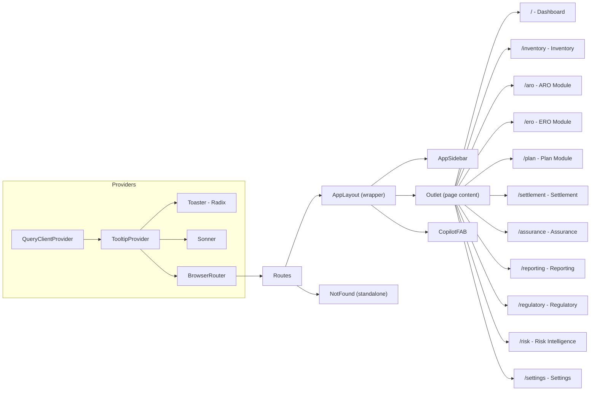

---

## Data Layer Architecture

All modules read from a single shared data layer (`mock-data.ts`). The data is structured as a hierarchical domain model.

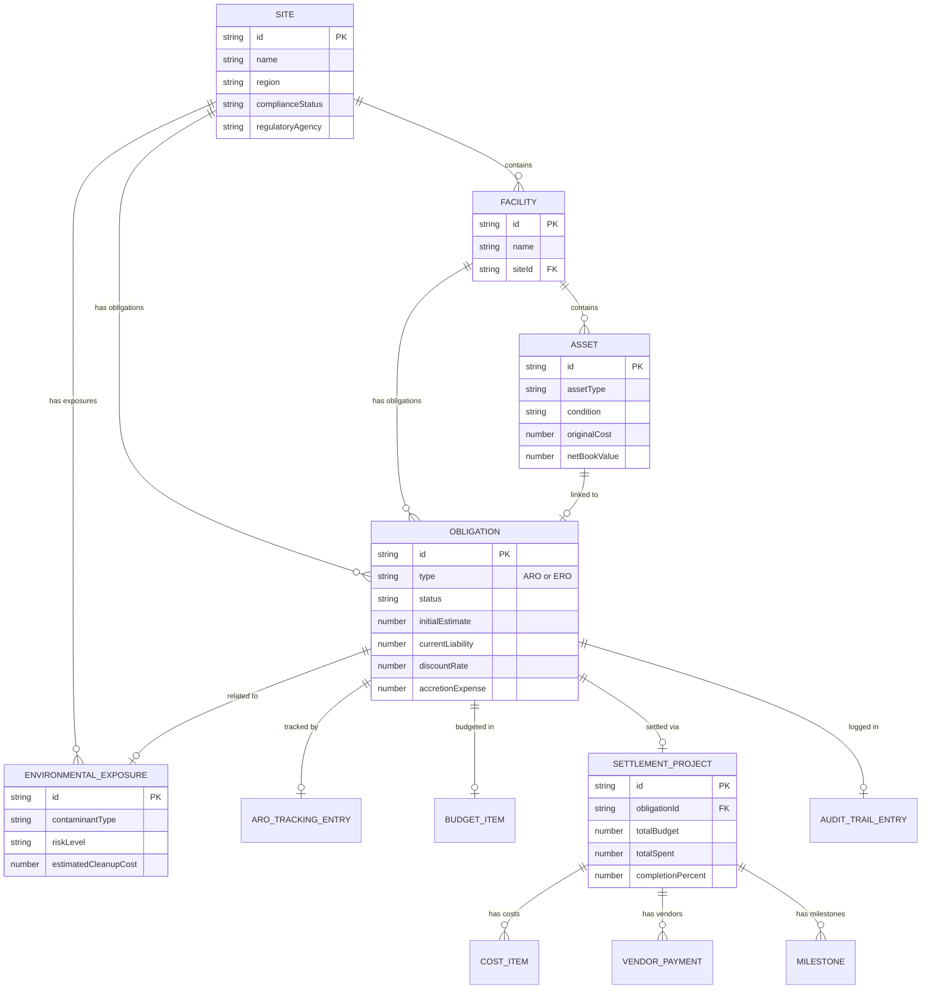

### Helper Function Dependency

```mermaid
graph TD
    subgraph "Exported Helper Functions"
        FC[formatCurrency]
        FCK[formatCurrencyK]
        CPV[calculatePresentValue]
        GAS[generateAccretionSchedule]
        GARO[getAROObligations]
        GERO[getEROObligations]
        GAO[getActiveObligations]
        GTL[getTotalLiability]
        GTA[getTotalAccretion]
        GOBS[getObligationsByStatus]
        GAA[getAllAssets]
    end

    subgraph "Consumed By"
        CE[Copilot Engine]
        AJE[ARO Justification Engine]
        RSE[Risk Scoring Engine]
        SSE[Scenario Simulator Engine]
        VIE[Variance Intelligence Engine]
        RIE[Regulatory Intelligence Engine]
        PG[Page Components]
    end

    FC --> CE
    FC --> AJE
    FC --> VIE
    FC --> RIE
    FCK --> CE
    FCK --> SSE
    FCK --> VIE
    GTL --> CE
    GTA --> CE
    GOBS --> CE
    GAS --> AJE
    CPV --> PG
    GAA --> PG
    GARO --> PG
    GERO --> PG
```

---

## Module Dependency Map

Shows which engines and data sources each page module depends on.

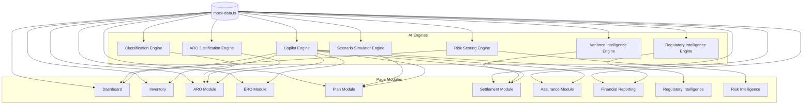

---

## Dashboard Data Flow

The executive dashboard aggregates data from multiple sources into a unified view.

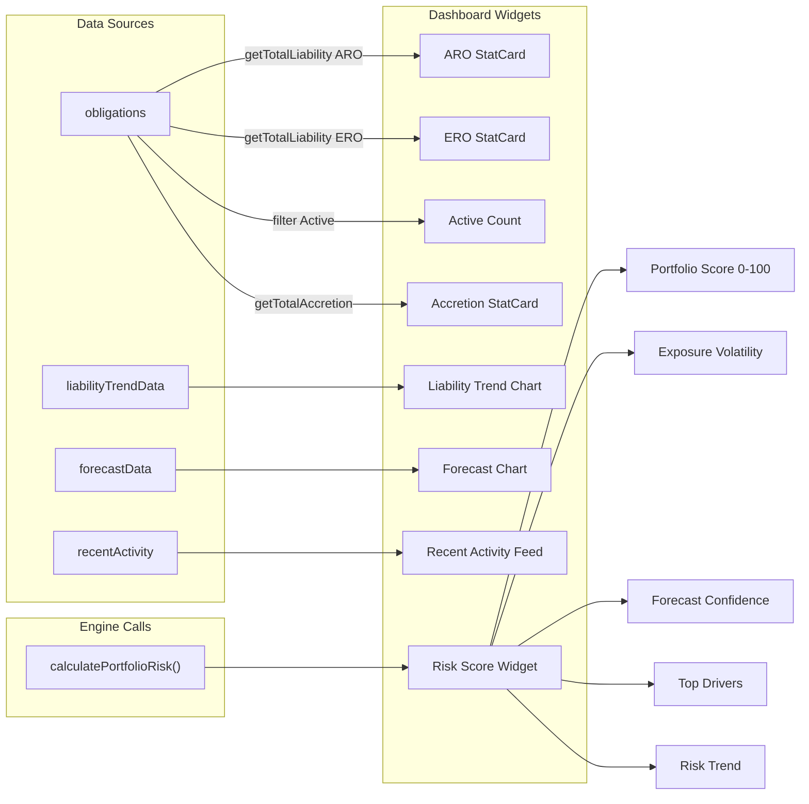

---

## Inventory Module — Hierarchy

The Inventory module provides a drill-down browser for the site-facility-asset-obligation hierarchy.

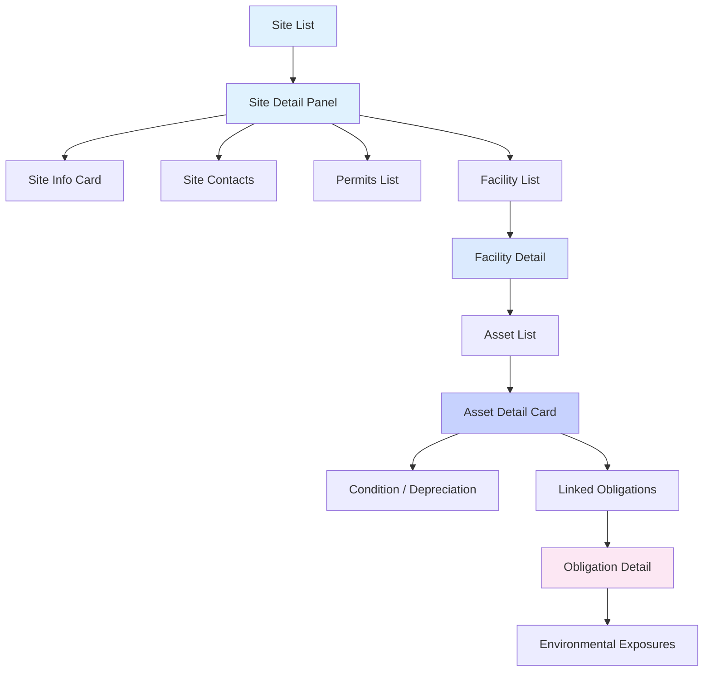

---

## ARO Module — Processing Pipeline

The ARO module combines tracking, document classification, and narrative generation.

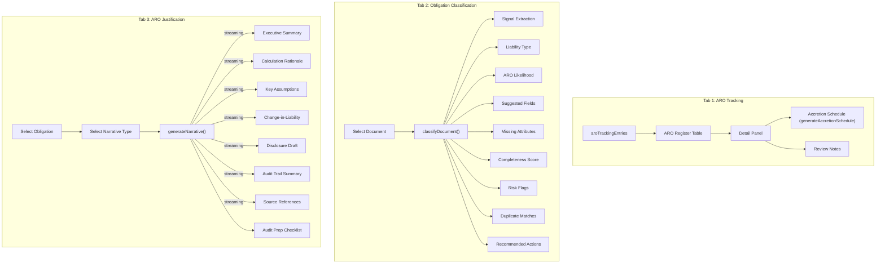

---

## ERO Module — Remediation Lifecycle

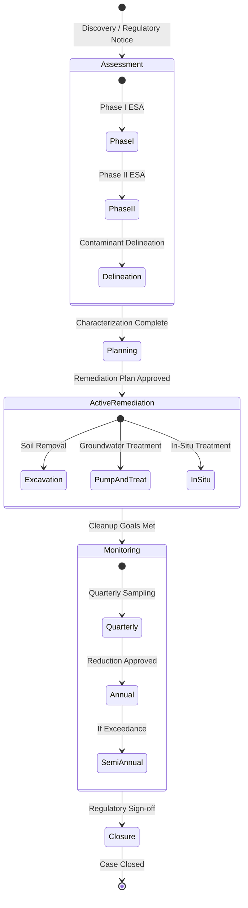

---

## Plan Module — Forecasting Pipeline

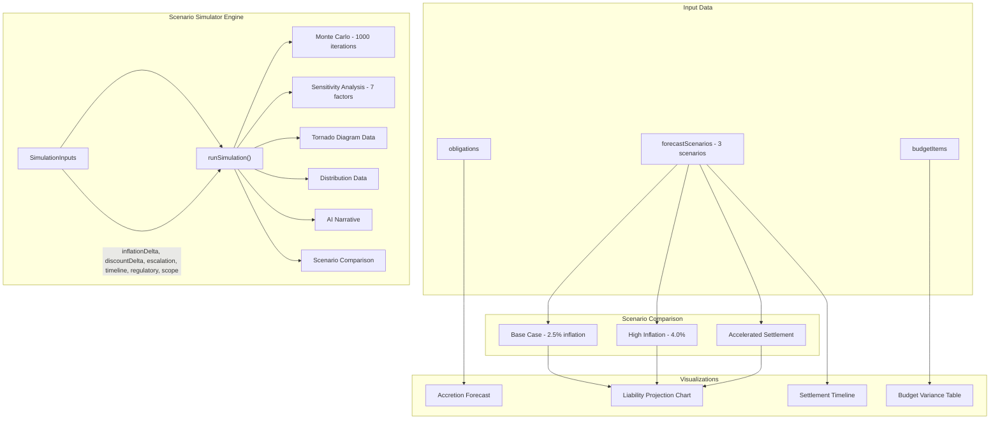

### Monte Carlo Simulation Detail

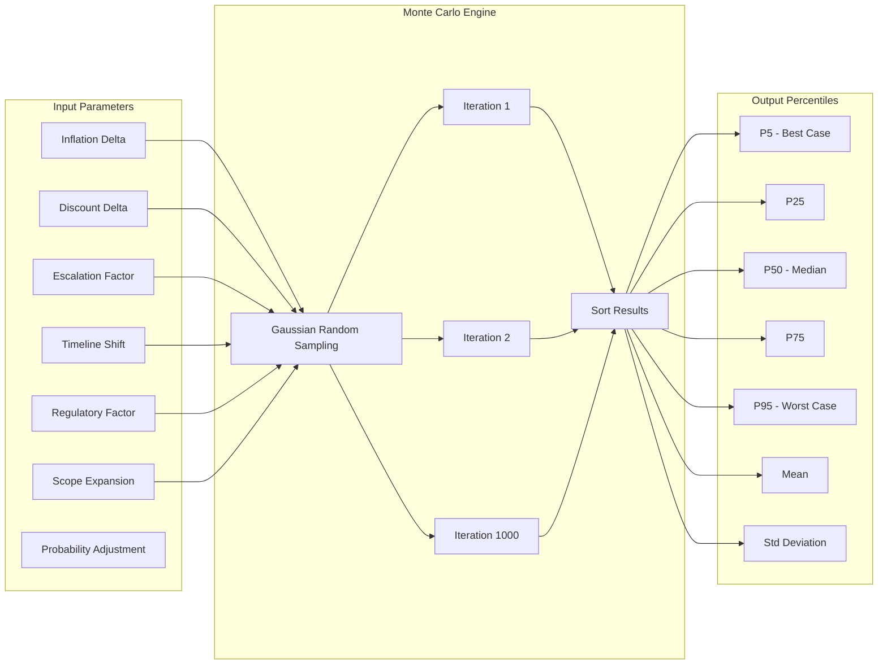

---

## Settlement Module — Variance Intelligence

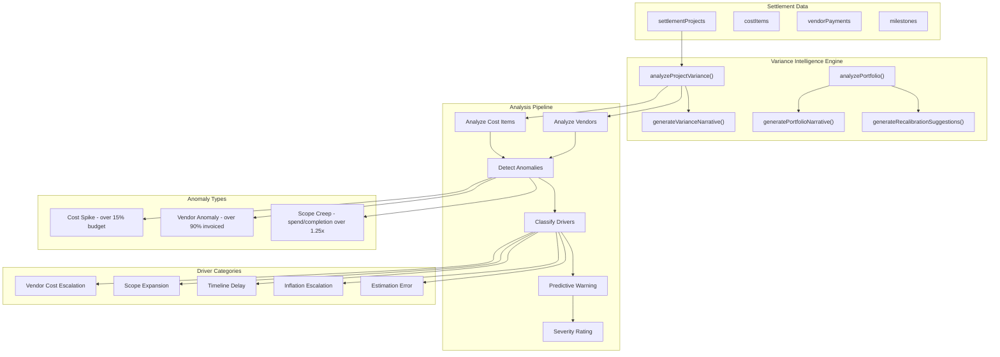

---

## Assurance Module — Audit Flow

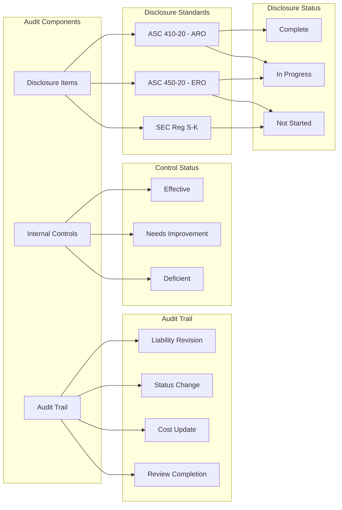

---

## Risk Intelligence — Scoring Pipeline

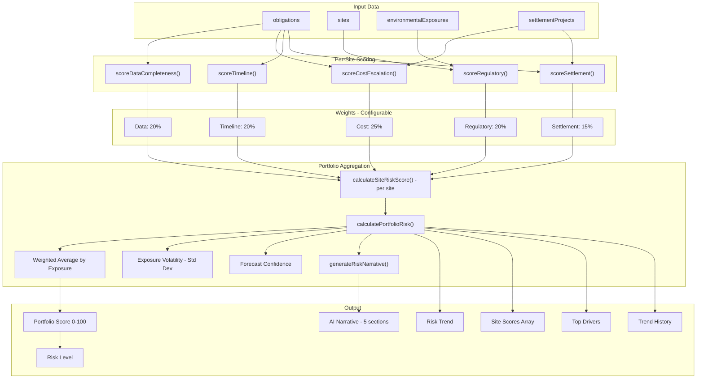

### Risk Level Classification

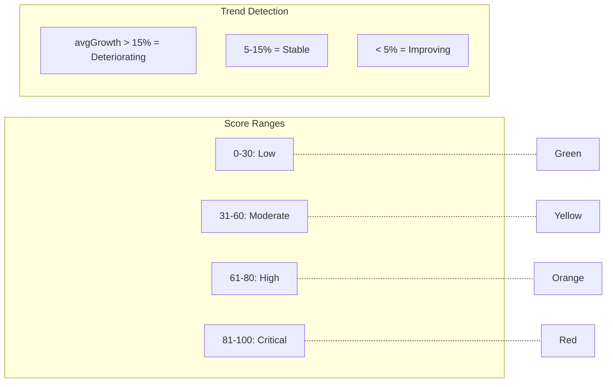

---

## Regulatory Intelligence — Impact Analysis

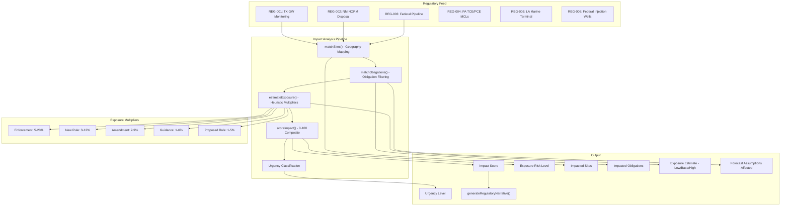

### Geography-to-Site Mapping

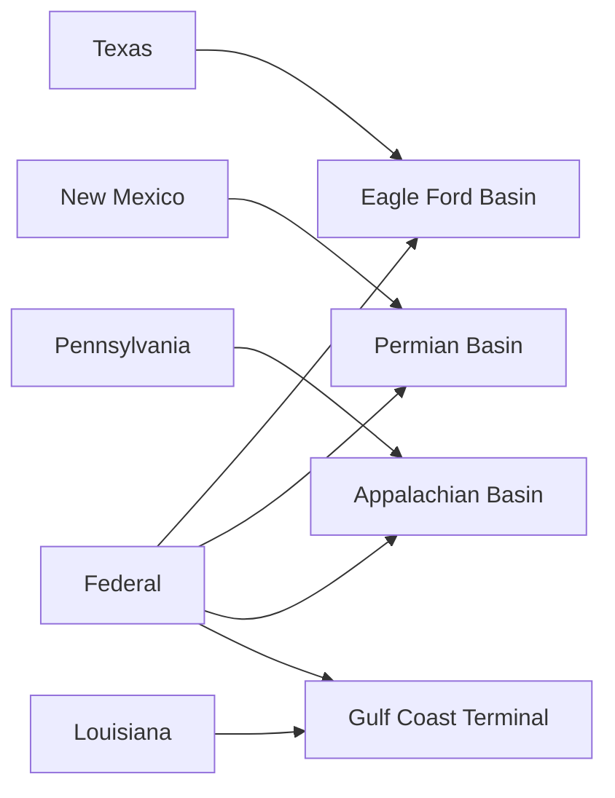

---

## AI Copilot — Query Resolution

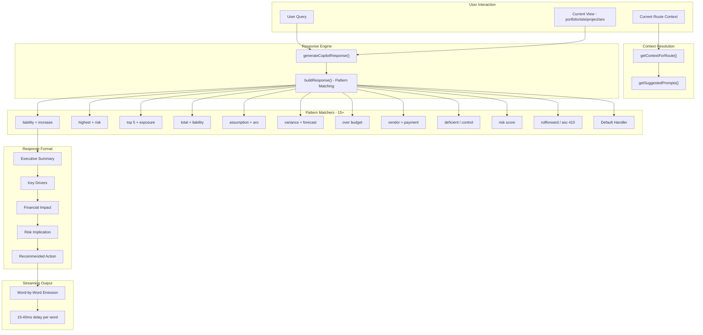

---

## Obligation Classification — Document Pipeline

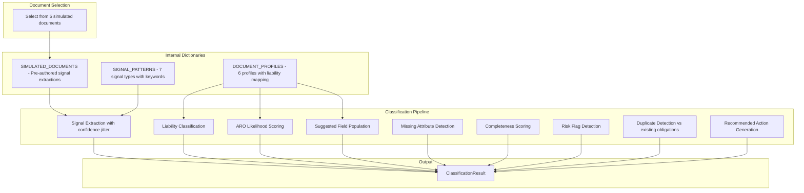

---

## Scenario Simulator — Monte Carlo Pipeline

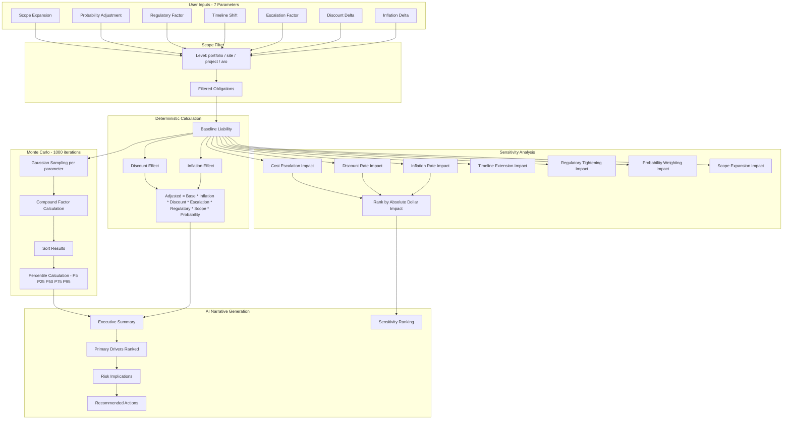

### Reverse Scenario Solver

```mermaid
graph LR
    TGT["Target: +15% liability change"] --> RSE["solveReverseScenario()"]
    PAR["Parameter: inflation / discount / timeline / escalation"] --> RSE
    RSE --> VAL["Required parameter value"]
    RSE --> LBL["Human-readable explanation"]
```

---

## Cross-Module Data Dependencies

Shows how data flows between feature modules through shared data and engine outputs.

```mermaid
graph TB
    subgraph "Core Data"
        OBL[obligations]
        SITES[sites]
        EXPO[exposures]
    end

    subgraph "Inventory Module"
        INV_H[Site/Facility/Asset Hierarchy]
        INV_O[Obligation Linkage]
    end

    subgraph "ARO Module"
        ARO_T[ARO Tracking]
        ARO_C[Classification]
        ARO_J[Justification Narratives]
    end

    subgraph "Plan Module"
        PLN_F[Forecast Scenarios]
        PLN_B[Budget Items]
        PLN_S[Scenario Simulator]
    end

    subgraph "Settlement Module"
        STL_P[Settlement Projects]
        STL_V[Variance Intelligence]
    end

    subgraph "Assurance Module"
        ASR_A[Audit Trail]
        ASR_C[Controls]
        ASR_D[Disclosures]
    end

    subgraph "Risk Intelligence"
        RSK_S[Risk Scoring Engine]
    end

    subgraph "Regulatory Intelligence"
        REG_U[Regulatory Updates]
        REG_A[Impact Analysis]
    end

    OBL --> INV_O
    OBL --> ARO_T
    OBL --> PLN_F
    OBL --> STL_P
    OBL --> RSK_S
    OBL --> REG_A
    OBL --> ARO_J

    SITES --> INV_H
    SITES --> RSK_S
    SITES --> REG_A

    EXPO --> RSK_S

    PLN_B --> VIE_REF[Variance Engine References]
    STL_P --> RSK_S
    STL_P --> STL_V

    ASR_A --> ARO_J
    ASR_D --> ARO_J

    PLN_F --> ARO_J
    PLN_F --> PLN_S

    REG_A -.->|"Forecast assumptions affected"| PLN_F
    STL_V -.->|"Recalibration suggestions"| PLN_F
    RSK_S -.->|"Risk score widget"| IDX_DASH[Dashboard]
    ARO_J -.->|"Disclosure drafts"| ASR_D
```

---

## Component Hierarchy

```mermaid
graph TD
    APP[App.tsx]
    APP --> QCP[QueryClientProvider]
    QCP --> TTP[TooltipProvider]
    TTP --> TST[Toaster]
    TTP --> SON[Sonner]
    TTP --> BR[BrowserRouter]

    BR --> RTS[Routes]
    RTS --> ALP[AppLayout]
    RTS --> NF[NotFound]

    ALP --> ASB[AppSidebar]
    ALP --> OTL[Outlet]
    ALP --> CFB[CopilotFAB]
    CFB --> CPL[CopilotPanel]

    OTL --> PG[Page Components]

    subgraph "Shared Tab Components"
        OCT[ObligationClassificationTab]
        AJT[AROJustificationTab]
        SST[ScenarioSimulatorTab]
        VIT[VarianceIntelligenceTab]
    end

    PG --> OCT
    PG --> AJT
    PG --> SST
    PG --> VIT

    subgraph "Reusable Components"
        STC[StatCard]
        NVL[NavLink]
    end

    PG --> STC
    ASB --> NVL
```

---

## Design System Architecture

```mermaid
graph TB
    subgraph "CSS Layer"
        IDX_CSS["index.css - CSS Custom Properties (HSL)"]
        TW_CFG["tailwind.config.ts - Token Mapping"]
    end

    subgraph "Semantic Tokens"
        BG["--background / --foreground"]
        PR["--primary / --primary-foreground"]
        SC["--secondary / --secondary-foreground"]
        MT["--muted / --muted-foreground"]
        AC["--accent / --accent-foreground"]
        DS["--destructive"]
        BD["--border / --input / --ring"]
        CD["--card / --card-foreground"]
    end

    subgraph "Component Library"
        SHAD["shadcn/ui - 60+ components"]
        CVA["class-variance-authority - Variants"]
        TWM["tailwind-merge - Class dedup"]
        CLSX["clsx - Conditional classes"]
    end

    subgraph "Utility"
        CN["cn() - utils.ts"]
    end

    IDX_CSS --> BG
    IDX_CSS --> PR
    IDX_CSS --> SC
    IDX_CSS --> MT
    IDX_CSS --> AC
    IDX_CSS --> DS
    IDX_CSS --> BD
    IDX_CSS --> CD

    TW_CFG --> SHAD
    BG --> SHAD
    PR --> SHAD

    CLSX --> CN
    TWM --> CN
    CN --> SHAD
    CVA --> SHAD
```

### Theme Modes

```mermaid
graph LR
    subgraph "Light Mode"
        LR1[":root { }"]
    end
    subgraph "Dark Mode"
        DR1[".dark { }"]
    end

    LR1 -->|"Toggle via next-themes"| DR1
    DR1 -->|"Toggle via next-themes"| LR1

    LR1 --> TC1["All semantic tokens redefined"]
    DR1 --> TC2["All semantic tokens redefined"]
```

---

## Key Design Decisions

### Why Client-Side Only?
- **No backend dependency**: Runs entirely in the browser
- **Instant feedback**: All AI engines respond synchronously (with simulated delays for realism)
- **Portable**: Deploy as static files to any CDN

### Why Simulated RAG?
- **Deterministic outputs**: Pattern-matched queries produce consistent, auditable responses
- **Domain expertise**: Pre-authored CFO-grade narratives ensure quality without LLM variance
- **No API keys**: No external AI service required
- **Controlled randomization**: `jitter()` and `gaussianRandom()` add realism without unpredictability

### Why Single Data File?
- **Single source of truth**: All modules read from the same `mock-data.ts`
- **Referential integrity**: Obligation → Site → Facility → Asset relationships are always consistent
- **Helper functions**: Centralized aggregation logic prevents duplication

### Why Separate Engine Files?
- **Separation of concerns**: Each engine is independently testable
- **Module isolation**: Engines import only from `mock-data.ts`, never from each other
- **Extensibility**: New engines can be added without modifying existing ones

---

*Architecture documentation for EOM Platform v1.0 — February 2026*
